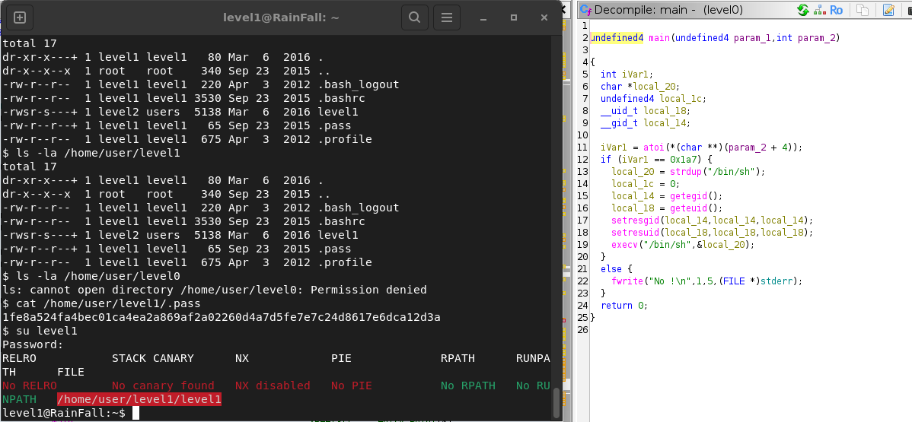

# level0 — vérification d'argument

Dans `main` : `atoi(argv[1])` est comparé à 0x1a7 (423). Si ça matche, il fait `setresuid`/`setresgid` vers l'uid de level1 puis `execv("/bin/sh")`.

    ./level0 423

